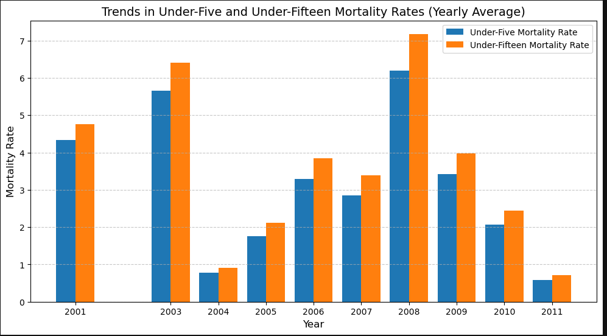

# Child and Infant Mortality Analysis 

---
## Introduction
This project focuses on analyzing child and maternal mortality data across various countries, providing insights into mortality trends, key influencing factors, and potential interventions. The analysis involves cleaning, merging, and visualizing data to uncover actionable insights that address global health challenges.

This project is a culmination of my training at Regonet Global under the guidance of Tutors Mr. Dayo Dada and Mr. David.

## Project Context

Child and infant mortality remain significant challenges in Africa, driven by various socio-economic, healthcare, and policy-related factors. This project aims to:
Understand the key contributors to mortality rates.
- Assess the impact of immunization and healthcare initiatives.
- Identify actionable insights for reducing mortality.
- The project involved cleaning, merging, and analyzing datasets to generate meaningful visualizations and recommendations.

## Problems Solved

1. Cleaning and preprocessing of eight separate datasets.
2. Merging datasets into a single cohesive file: `merged_cleaned_data.csv`.
3. Handling missing values to ensure data completeness.
4. Analyzing trends in child and infant mortality rates.
5. Exploring relationships between healthcare metrics and mortality rates.
6. Identifying countries with the highest and lowest mortality rates.
   
## Skills Demonstrated
- Data Cleaning and Preprocessing: Efficiently handled missing values and inconsistencies across multiple datasets.
- Data Integration: Merged eight datasets into a unified dataset for comprehensive analysis.
- Exploratory Data Analysis: Applied statistical methods and visualizations to derive meaningful insights.
- Data Visualization: Created engaging and informative visualizations using Python libraries.
- Report Writing: Documented findings and actionable recommendations effectively.

## Technologies Used
- **Programming Language**: Python
- **Libraries**: Pandas, NumPy, Matplotlib, Seaborn
- **Development Environment**: Jupyter Notebook
---
## Analysis and Key Findings

### Exploratory Data Analysis (EDA)
- **Trend Analysis**:
  A line plot that analyze trends in child and infant mortality rates over the years | A bar plot highlighted the steady decline in under-five and 
   under-fifteen mortality rates from 2001 to 2011.
  :--------------------------------------------------------------------------------:|:-----------------------------------------------------------:
 | 
  
- **Regional Disparities**: Countries such as Sierra Leone, Nigeria, and Central African Republic showed significantly higher mortality rates.

### Correlation Insights
- Strong positive correlation between under-five and under-fifteen mortality rates.
- Negative correlation between skilled birth attendance and mortality rates, emphasizing the importance of accessible healthcare.

### Key Visualizations
1. **Heatmap**: Showcased correlations between variables, identifying significant relationships.
   
2. **Bar Charts**: Highlighted maternal deaths and health insurance coverage across countries.
   
3. **Scatter Plots**: Illustrated relationships between mortality rates and healthcare metrics.
   
  
