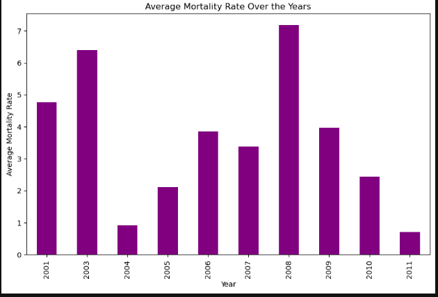
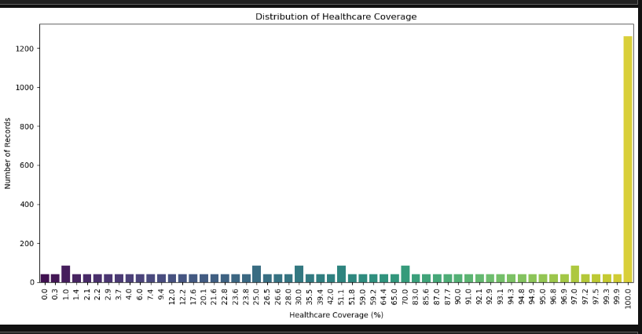
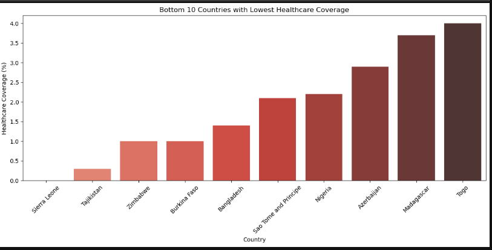
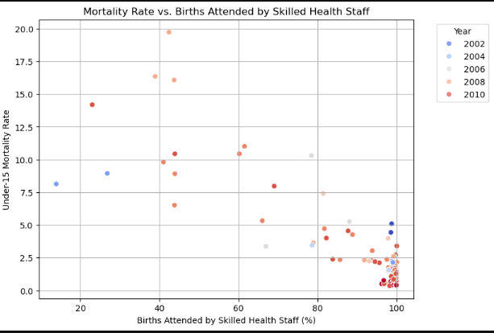
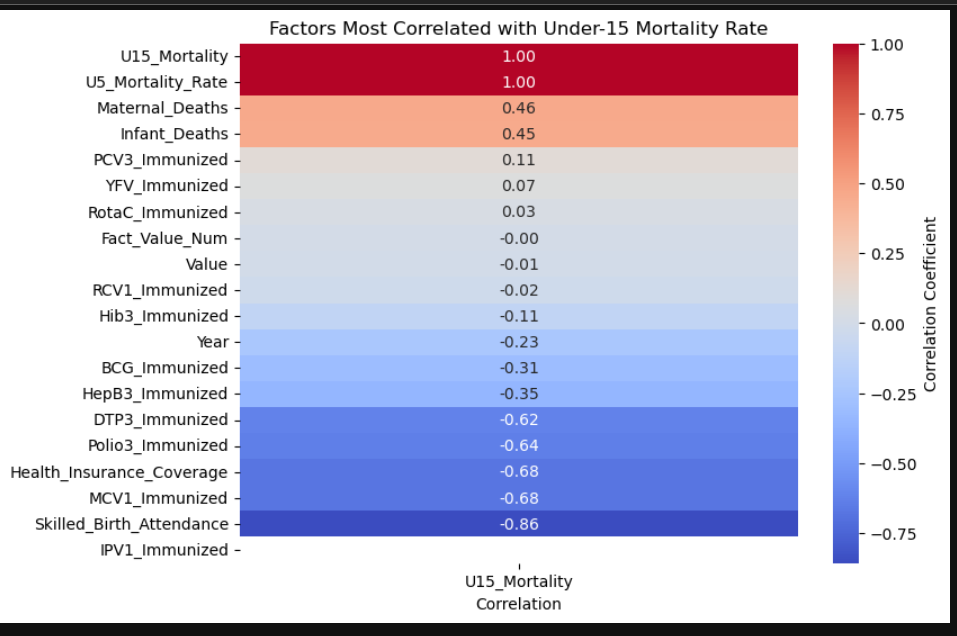

# Child and Infant Mortality Analysis 

---
## Introduction
This project examines child and infant mortality data across various countries, with a focus on key factors influencing mortality rates, trends over time, and the effectiveness of healthcare interventions. Through data cleaning, merging, and analysis, the project provides insights into the state of child and infant health across different countries.

## Problems Solved

1. Cleaning and preprocessing of eight separate datasets.
2. Merging datasets into a single cohesive file: `merged_cleaned_data.csv`.
3. Handling missing values to ensure data completeness.
4. Analyzing trends in child and infant mortality rates.
5. Exploring relationships between healthcare metrics and mortality rates.
6. Identifying countries with the highest and lowest mortality rates.
   
## Project Context

Child and infant mortality remain significant challenges in Africa, driven by various socio-economic, healthcare, and policy-related factors. This project aims to:
Understand the key contributors to mortality rates.
- Assess the impact of immunization and healthcare initiatives.
- Identify actionable insights for reducing mortality.
- The project involved cleaning and merging eight datasets into a comprehensive file, `**merged_cleaned_data.csv** to generate meaningful analysis, visualizations and recommendations.
- This analysis is part of a training project undertaken as a trainee at Regonet Global. The datasets were provided by my tutor, Mr. Dayo Dada, as the final project of the program.

## Skills Demonstrated
- Data Cleaning and Preprocessing: Efficiently handled missing values and inconsistencies across multiple datasets.
- Data Integration: Merged eight datasets into a unified dataset for comprehensive analysis.
- Exploratory Data Analysis: Applied statistical methods and visualizations to derive meaningful insights.
- Data Visualization: Created engaging and informative visualizations using Python libraries.
- Report Writing: Documented findings and actionable recommendations effectively.

## Technologies Used
- **Programming Language**: Python
- **Libraries**: Pandas, NumPy, Matplotlib, Seaborn
- **Development Environment**: Jupyter Notebook

## Datasets Used
1. **Dataset 1**: Child mortality rates by country.
2. **Dataset 2**: Maternal deaths.
3. **Dataset 3**: Immunization rates.
4. **Dataset 4**: Healthcare coverage statistics.
5. **Dataset 5**: Income levels by country.
6. **Dataset 6**: Skilled birth attendance.
7. **Dataset 7**: Infant deaths.
8. **Dataset 8**: Major causes of death in children under five.

## Steps Taken
### 1. Data Cleaning
- Removed duplicates and handled missing values.
- Standardized column names for consistency.

### 2. Data Merging
- Combined the eight datasets into `merged_cleaned_data.csv`.
- The merged dataset covers 91 unique countries between the years 2001 and 2011.

### 3. Exploratory Data Analysis
- Investigated trends and patterns in child and infant mortality.
- Explored correlations between mortality rates and healthcare factors.

### 4. Data Visualization
- Created heatmaps, bar plots, scatter plot and lineplots to illustrate key findings.
  
---

## Files in the Repository
1. **Jupyter Notebooks**:
   - `1_handling_missing_values.ipynb`: Data cleaning and handling missing values.
   - `2_merging_and_visualization.ipynb(1)`: Merging datasets and generating visualizations.

2. **Data Files**:
   - `merged_cleaned_data.csv`: The cleaned and merged dataset used for analysis.

3. **Images**:
   - Plots and visualizations are stored in the `images/` directory.
 --- 
## Analysis and Visualizations

### Exploratory Data Analysis (EDA)
### **Trend Analysis**:.A line plot that analyze trends in child and infant mortality rates over the years   
  - Fluctuations in Under-Five Mortality Rate Peaks in 2003 (5.65) and 2008 (6.20) and Significant drops in 2004 (0.77) and 2011 (0.58).
  - Infant Deaths show Sharp spikes in 2003 (90,615) and 2008 (78,531) and Gradual decline observed from 2009 to 2011.
    
    
### Analysis of How Mortality Rates Have Changed Over the Years
  - There is an inconsistent trend in the average mortality rate over time, with some years showing sharp increases (e.g., 2003, 2008) and others showing declines (e.g., 2004, 2010).
 - The average mortality rate has generally declined toward the later years of the timeline (e.g., 2011 shows the lowest value).
   
### **Regional Disparities**
  - Sierra Leone, Nigeria, and Central African Republic exhibit the highest under-fifteen mortality rates, with Sierra Leone topping the list.
  - Countries like Sierra Leone, Nigeria, and Central African Republic significantly have the highest under-five mortality rates
  - Nigeria leads with the highest infant deaths, followed by Bangladesh and Pakistan.
  - Nigeria leads with the highest maternal deaths, followed by Bangladesh and Pakistan,Sub-Saharan Africa dominates the list, highlighting regional healthcare challenges while China has notable maternal deaths, likely due to its large population.
   
### Percentage Distribution of Healthcare Coverage Across Countries.
   - Most countries in the dataset report full health insurance coverage, which might correlate with better health outcomes.
   - Many countries have partial or no health insurance coverage, possibly correlating with higher mortality rates.
   

### Bar Plot For Bottom 10 Countries with the Lowest Healthcare Coverage
   - Countries like Sierra Leone, Tajikistan, and Zimbabwe have the lowest healthcare coverage percentages, with Sierra Leone at the very bottom.
   - The healthcare coverage in these countries ranges from near 0% to around 4%.
     

### Illustrated Relationships Between Mortality Rates and Births Attended by Skilled Health Staff
   - There is a clear inverse relationship between the percentage of births attended by skilled health staff and under-15 mortality rates.
   - Countries or regions with higher rates of skilled birth attendance tend to have significantly lower under-15 mortality rates.
   - Over the years (2002–2010), improvements in skilled birth attendance are evident, especially as data points concentrate toward higher percentages and lower 
     mortality rates.
     

### Factors Most Correlated with Under-15 Mortality Rate
- Strong positive correlation between under-five and under-fifteen mortality rates.
- Negative correlation between skilled birth attendance and mortality rates, emphasizing the importance of accessible healthcare.
  
---

## Limitations
1. **Data Coverage**: The dataset only includes data from 2001 to 2011, excluding more recent trends.
2. **Data Completeness**: Missing values in some datasets may impact the accuracy of the analysis.
3. **Causation vs Correlation**: While correlations were identified, causative relationships could not be established due to the scope of the project.

## Conclusion

This project highlights critical insights into child and infant mortality in Africa, emphasizing the need for improved healthcare coverage, immunization programs, and maternal health services. Countries with high mortality rates often face socio-economic and healthcare access challenges that require targeted interventions.

### Recommendations

1. **Strengthen Immunization Programs**: Increase immunization coverage for diseases like DTP3 and Polio to reduce preventable deaths.
2. **Improve Maternal Healthcare**: Enhance access to skilled birth attendants and maternal healthcare services.
3. **Expand Healthcare Coverage**: Provide affordable health insurance, especially in low-income countries.
4. **Focus on High-Mortality Countries**: Prioritize interventions in countries like Nigeria, Sierra Leone, and the Central African Republic.

## Acknowledgments
I would like to express my gratitude to Regonet Global for the opportunity to undertake this project. Special thanks to my tutors, Mr. Dayo Dada and Mr. David, for their guidance and support throughout my training.

## Contact
For any questions or collaboration inquiries, feel free to reach out.
- **Atanada Adejumoke**: 
[My Github Profile](https://github.com/Adejumoke10)
- **Regonet Global**: 
[Regonet Website](https://regonetglobal.com)
- **Tutors**:
[Mr Dayo Dada Github Profile](https://github.com/Deewhy254) and
[Mr. David GitHub Profile](github)

     

  
